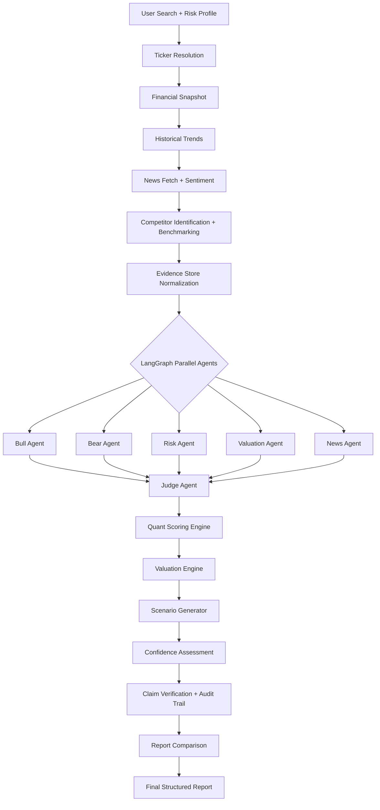
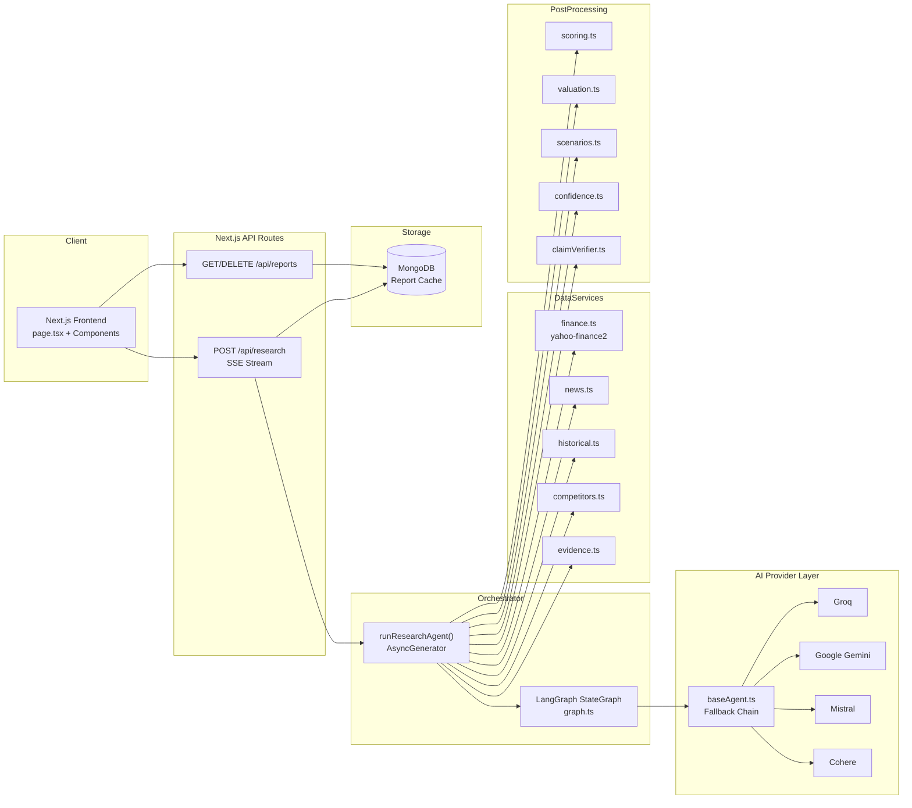

# InvestAI

**AI-powered financial research through real market data, specialized AI agents, and structured multi-perspective debate.**

InvestAI is a full-stack investment research platform that turns a company name or ticker into a structured research report. It gathers live financial data from Yahoo Finance, analyzes recent news, benchmarks peers, and runs a LangGraph-orchestrated multi-agent debate before producing an evidence-backed verdict.

Built for investors, students, and engineers who want balanced, transparent equity research — not a single chatbot opinion.

[](https://nextjs.org/)
[](https://react.dev/)
[](https://www.typescriptlang.org/)
[](https://nodejs.org/)
[]()

**Repository:** [github.com/Akshatgupta000/invest](https://github.com/Akshatgupta000/invest)

---

## Project Overview

InvestAI automates the research workflow that normally requires jumping between financial terminals, news sites, spreadsheets, and subjective analyst notes. Instead of asking one LLM whether a stock is a buy, the system:

1. Collects and normalizes real financial data
2. Dispatches five specialized AI agents in parallel, each with a distinct analytical mandate
3. Synthesizes the debate through a separate Judge agent
4. Cross-validates AI reasoning with a deterministic scoring engine
5. Streams every step to the UI in real time

**Who it is for:** retail investors learning fundamentals, finance students, and engineers evaluating multi-agent AI architectures.

**What makes it different from a chatbot or stock dashboard:** dashboards show data; chatbots synthesize from memory. InvestAI combines both — grounding every agent in a normalized evidence layer, forcing adversarial perspectives, and rendering a structured report with audit trails, quant scores, and risk-profile-aware verdicts.

---

## The Problem

Investment research is difficult for several concrete reasons:

| Challenge | Why it matters |
| --------- | -------------- |
| Fragmented data | Fundamentals, news, peers, and valuation live on different platforms |
| Hard-to-interpret metrics | Raw P/E, debt ratios, and growth rates need context to be meaningful |
| Single-model AI bias | One LLM prompt tends toward middle-of-the-road or confirmation-biased answers |
| No adversarial review | Bullish narratives rarely get stress-tested by a dedicated bear case |
| Risk tolerance ignored | The same company can be suitable or unsuitable depending on investor profile |
| Weak traceability | Generic AI answers rarely cite the underlying data used |

---

## The Solution

InvestAI implements a structured research pipeline:

- **Financial market data** via `yahoo-finance2` (price, fundamentals, historical charts)
- **Company fundamentals** normalized into an immutable evidence store with unique IDs
- **Recent news** fetched and classified for sentiment
- **AI reasoning** through five domain-specialized agents plus a Judge
- **Multiple independent perspectives** running in parallel before synthesis
- **Risk profiling** that adjusts scoring thresholds and penalties
- **Evidence-based synthesis** combining quant scoring, judge reasoning, and claim verification

The output is decision-support research — not personalized financial advice.

---

## Core Features

### Smart Company Search

Users enter a company name or ticker (e.g., `Apple`, `NVDA`). The backend resolves it to a tradable equity symbol using Yahoo Finance search, preferring equity-type results.

### Real Financial Data

`fetchFinancialData()` pulls a financial snapshot including:

- Price, market cap, enterprise value
- Valuation multiples (P/E, forward P/E, PEG, P/S, P/B, EV/EBITDA)
- Profitability (net, operating, gross margins; ROE; ROA)
- Growth (revenue, earnings)
- Balance sheet signals (debt, cash, debt-to-equity, current ratio)
- Cash flow (free cash flow, operating cash flow)
- Analyst consensus (target price, recommendation key)

Data is sourced from Yahoo Finance `quoteSummary` modules.

### Historical Trend Analysis

Three years of price history are fetched to compute:

- Price changes (1M, 6M, 1Y, 3Y)
- Volatility and max drawdown
- Revenue, net income, margin, FCF, debt, and EPS trend directions

### News Analysis

Up to 15 recent headlines are fetched per ticker. An LLM classifies them into bullish, bearish, and neutral buckets, computes an overall sentiment score (-100 to 100), and extracts major events. A keyword-based fallback runs if the LLM call fails.

### Competitor Benchmarking

An LLM identifies 3–5 public competitors. Their financials are fetched and the target company is ranked on metrics like P/E, profit margin, and revenue growth with percentile explanations.

### Multi-Agent Debate

Five specialist agents analyze the same evidence independently in parallel. A sixth Judge agent synthesizes their outputs. Agents do **not** see each other's responses during analysis — only the Judge receives all agent outputs.

| Agent | Role |
| ----- | ---- |
| **Bull** | Builds the strongest positive investment case (growth, margins, catalysts) |
| **Bear** | Builds the strongest negative case (overvaluation, declining trends, threats) |
| **Risk** | Assesses downside risk, volatility, debt, and suitability for the user's risk profile |
| **Valuation** | Evaluates absolute and relative valuation multiples |
| **News** | Synthesizes recent events and sentiment momentum |
| **Judge** | Weighs all perspectives and issues a final verdict with confidence |

### Risk Profiling

Three modes are available in the UI:

| Profile | Behavior |
| ------- | -------- |
| **Conservative** | Raises INVEST threshold to 75; penalizes weak financial health and high risk |
| **Balanced** | Default threshold of 60 |
| **Aggressive** | Lowers INVEST threshold to 50; rewards high growth |

Risk profile is passed to the Risk and Judge agents and applied in the quant scoring engine.

### Live Research Console

`AgentTerminal` renders a terminal-style console showing real-time progress across 14 pipeline steps. Updates are delivered via Server-Sent Events (SSE) from `POST /api/research`.

### Structured Final Report

The `ReportViewer` renders:

- Final verdict (`INVEST`, `WATCHLIST`, or `PASS`) and quant score (0–100)
- Judge thesis and AI confidence score
- Score breakdown by category (Valuation, Financial Health, Growth & Momentum, Peer Comparison, News Sentiment)
- Key financials tear sheet
- Bull / Base / Bear scenario analysis
- Full agent debate with arguments and evidence citations
- Competitor percentile benchmarks
- Audit trail linking claims to evidence
- Top bullish news with external links
- "What Changed" comparison vs. previous report
- Markdown export

### Report History & Caching

- Completed reports are persisted to MongoDB
- Reports matching the same query, risk profile, and ticker within 6 hours are served from cache
- A history sidebar lists past reports with delete support

### Responsive User Experience

The UI uses a dark, glassmorphic design system (`globals.css`) with Inter and JetBrains Mono fonts, purple/lime accent colors, backdrop-blur cards, and responsive grid layouts for search suggestions and report sections.

---

## How the Multi-Agent System Works

### Pipeline Overview



### Step-by-Step Workflow

1. **User Search** — Client sends `{ query, riskProfile }` to `/api/research`
2. **Company Resolution** — `findTicker()` resolves name/ticker via Yahoo Finance search
3. **Financial Data Collection** — Snapshot from `quoteSummary` modules
4. **Historical Data** — 3-year price chart and statement trends
5. **News Collection** — Headlines from Yahoo Finance search API
6. **News Sentiment** — LLM classification with keyword fallback
7. **Competitor Benchmarking** — LLM peer identification + financial comparison
8. **Context Preparation** — All data normalized into `EvidenceItem[]` with unique IDs
9. **Parallel Agent Analysis** — LangGraph fans out from `START` to five agents concurrently
10. **Judge Evaluation** — Judge receives all five agent outputs (agents never see each other)
11. **Quant Scoring** — Deterministic 0–100 score with risk-profile adjustments
12. **Valuation & Scenarios** — Rule-based valuation status + LLM-generated Bull/Base/Bear scenarios
13. **Verdict Resolution** — Quant verdict is primary; Judge overrides only if confidence > 85
14. **Audit & Report** — Claims verified against evidence IDs; report saved to MongoDB

### Agent Inputs and Outputs

**Inputs (all agents):** company name, ticker, risk profile, financial snapshot, historical trends, competitor benchmarks, news sentiment summary, and the full evidence array (id, title, value, direction).

**Outputs (specialist agents):** structured JSON via Zod schemas — summary, thesis, arguments (with evidence IDs), concerns, missing data, and a `scoreBias` (-100 to 100).

**Judge output:** same structure plus `finalVerdict` (`INVEST` | `WATCHLIST` | `PASS`) and `finalConfidence` (0–100).

### Reducing Hallucination Risk

- Financial data is fetched from Yahoo Finance before any agent runs
- Agents are instructed to cite only evidence IDs from the provided store
- `claimVerifier.ts` penalizes arguments with missing or invalid evidence IDs
- The audit trail surfaces unsupported claims in the UI
- A hybrid quant engine provides deterministic scoring independent of LLM narrative

---

## System Architecture



---

## User Flow

1. User opens the app and enters a company name or ticker
2. User selects a risk profile (Conservative, Balanced, or Aggressive)
3. User submits the search (or clicks a suggested company card)
4. The live terminal shows 14 progress steps as data is gathered
5. Five specialist agents run in parallel; the Judge synthesizes their debate
6. Quant scoring, valuation, scenarios, and confidence are computed
7. A structured report appears with verdict, scores, agent debate, and audit trail
8. The report is saved to MongoDB and appears in the history sidebar
9. User can export the report to Markdown or start a new analysis

---

## Tech Stack

| Category | Technologies |
| -------- | ------------ |
| Frontend | Next.js 16 (App Router), React 19, TypeScript |
| Styling | Tailwind CSS 4, custom CSS design tokens, glassmorphism utilities |
| Icons | Lucide React |
| Backend | Next.js API Routes (Node.js runtime) |
| AI Orchestration | LangGraph, LangChain.js |
| AI Providers | Groq, Google Gemini, Mistral, Cohere (multi-provider fallback chain) |
| Structured Output | Zod schemas with LangChain `.withStructuredOutput()` |
| Financial Data | `yahoo-finance2` (Yahoo Finance) |
| Database | MongoDB with Mongoose |
| Streaming | Server-Sent Events via `ReadableStream` |
| Validation | Zod request schemas |
| Authentication | None (open research endpoint with IP rate limiting) |
| Deployment | Compatible with Vercel or any Node.js host (no deployment config in repo) |
| Developer Tools | ESLint, TypeScript, PostCSS |

> **Note:** OpenAI is not used in the current codebase. LLM calls route through Groq, Gemini, Mistral, and Cohere.

---

## Project Structure

```
invest/
├── public/                          # Static assets (SVG icons)
├── src/
│   ├── app/
│   │   ├── api/
│   │   │   ├── research/route.ts    # POST — SSE research pipeline
│   │   │   └── reports/route.ts     # GET list / DELETE by id
│   │   ├── globals.css              # Dark glassmorphic design system
│   │   ├── layout.tsx               # Root layout and metadata
│   │   └── page.tsx                 # Main search, terminal, and report UI
│   ├── components/
│   │   ├── AgentDebate.tsx          # Multi-agent argument display
│   │   ├── AgentTerminal.tsx        # Live SSE progress console
│   │   ├── AuditTrail.tsx           # Evidence-backed claim audit
│   │   ├── CompetitorComparison.tsx # Peer percentile benchmarks
│   │   ├── EvidenceTable.tsx        # Evidence store table
│   │   ├── KeyFinancials.tsx        # Financial metrics tear sheet
│   │   ├── ReportViewer.tsx         # Structured report layout
│   │   ├── ScenarioAnalysis.tsx     # Bull / Base / Bear scenarios
│   │   ├── ScoreBreakdown.tsx       # Quant score by category
│   │   └── WhatChangedView.tsx      # Delta vs. previous report
│   ├── lib/
│   │   ├── agent.ts                 # Research orchestrator (AsyncGenerator)
│   │   ├── graph.ts                 # LangGraph StateGraph definition
│   │   ├── agents/
│   │   │   ├── baseAgent.ts         # LLM fallback chain + runAgent()
│   │   │   ├── parallelAgents.ts    # Bull, Bear, Risk, Valuation, News prompts
│   │   │   └── judgeAgent.ts        # Judge synthesis prompt
│   │   ├── finance.ts               # Yahoo Finance data fetching
│   │   ├── news.ts                  # News fetch + sentiment classification
│   │   ├── historical.ts            # 3-year trend analysis
│   │   ├── competitors.ts           # Peer identification + benchmarking
│   │   ├── evidence.ts              # Evidence store builder
│   │   ├── scoring.ts               # Deterministic quant scoring
│   │   ├── valuation.ts             # Rule-based valuation engine
│   │   ├── scenarios.ts             # LLM scenario generator
│   │   ├── confidence.ts            # Confidence score calculator
│   │   ├── claimVerifier.ts         # Evidence citation verification
│   │   ├── reportComparison.ts      # What-changed delta logic
│   │   ├── exportMarkdown.ts        # Report markdown export
│   │   ├── llm.ts                   # Shared LLM helper (Groq/Gemini)
│   │   ├── rateLimit.ts             # In-memory IP rate limiting
│   │   ├── db.ts                    # Mongoose connection cache
│   │   ├── validation.ts            # API request Zod schemas
│   │   ├── validation/agentSchemas.ts # Agent output Zod schemas
│   │   └── types/research.ts        # Shared TypeScript types
│   └── models/
│       └── Report.ts                # Mongoose report schema
├── next.config.ts
├── package.json
├── tsconfig.json
├── postcss.config.mjs
├── eslint.config.mjs
├── PROJECT_OVERVIEW.md              # Extended architectural deep dive
└── AI_USAGE_LOGS.md                 # AI development session logs
```

---

## Getting Started

### Prerequisites

- **Node.js** 18 or later
- **npm** (project uses `package-lock.json`)
- **MongoDB** cluster URI (required for report persistence and caching)
- **At least one LLM API key** (Groq, Gemini, Mistral, or Cohere)

### Installation

```bash
git clone https://github.com/Akshatgupta000/invest.git
cd invest
npm install
```

### Environment Setup

Create a `.env.local` file in the project root:

```env
MONGODB_URI=
GROQ_API_KEY=
GEMINI_API_KEY=
MISTRAL_API_KEY=
COHERE_API_KEY=
```

At minimum, `MONGODB_URI` and at least one LLM provider key are required for the application to function.

### Running Locally

```bash
# Development server
npm run dev

# Production build
npm run build
npm start

# Lint
npm run lint
```

Open [http://localhost:3000](http://localhost:3000) in your browser.

---

## Environment Variables

| Variable | Required | Description |
| -------- | -------- | ----------- |
| `MONGODB_URI` | Yes | MongoDB connection string for report storage and 6-hour cache lookups |
| `GROQ_API_KEY` | No* | Groq API key — primary provider (`llama-3.3-70b-versatile`, `llama-3.1-8b-instant`) |
| `GEMINI_API_KEY` | No* | Google Gemini API key (`gemini-2.0-flash`, `gemini-1.5-flash` fallback) |
| `MISTRAL_API_KEY` | No* | Mistral API key (`mistral-small-latest`) |
| `COHERE_API_KEY` | No* | Cohere API key (`command-r`) |

\*At least one of the four LLM API keys must be set. The agent fallback chain tries providers in order: Groq → Gemini → Mistral → Cohere → Groq (smaller model) → Gemini 1.5 Flash.

---

## API Overview

| Method | Endpoint | Purpose |
| ------ | -------- | ------- |
| `POST` | `/api/research` | Run the full research pipeline. Returns an SSE stream of `AgentStep` events ending with `{ type: "complete", report }`. Accepts `{ query: string, riskProfile: "conservative" \| "balanced" \| "aggressive" }`. Rate limited to 10 requests per 10 minutes per IP. |
| `GET` | `/api/reports` | List up to 50 most recent saved reports (company, ticker, verdict, confidence, createdAt). |
| `DELETE` | `/api/reports?id={reportId}` | Delete a saved report by MongoDB document ID. |

### SSE Event Types

The research stream emits typed events including: `start`, `progress`, `ticker_resolved`, `financial_data_loaded`, `agents_started`, `agent_completed`, `scoring_completed`, `judge_completed`, `complete`, and `error`. The frontend accumulates these in `AgentTerminal` and renders the final report on `complete`.

---

## AI Provider Architecture

### Available Providers

| Provider | Models Used | Priority |
| -------- | ----------- | -------- |
| Groq | `llama-3.3-70b-versatile`, `llama-3.1-8b-instant` | 1 (primary), 5 (last resort) |
| Google Gemini | `gemini-2.0-flash`, `gemini-1.5-flash` | 2, 6 (final fallback) |
| Mistral | `mistral-small-latest` | 3 |
| Cohere | `command-r` | 4 |

### Selection and Fallback

- `baseAgent.ts` builds a model chain from whichever API keys are present in the environment
- Each agent call tries models sequentially via `callWithFallback()`
- Rate limits (HTTP 429) trigger exponential backoff (4s × attempt) before trying the next provider
- Agents are staggered with a random 0–6s delay to spread concurrent API load
- If all models fail, agents return a structured fallback response (Judge defaults to `PASS` with 0 confidence)
- Auxiliary tasks (news sentiment, competitor ID, scenarios) use `llm.ts` which prefers Groq, then Gemini

### Structured Output

All agent responses are validated against Zod schemas (`AgentOutputSchema`, `JudgeOutputSchema`) using LangChain's `.withStructuredOutput()`, ensuring predictable UI rendering.

---

## Security and Reliability

| Measure | Implementation |
| ------- | -------------- |
| Secret management | API keys and MongoDB URI stored in `.env.local` (gitignored) |
| Server-side API calls | Financial data and LLM calls execute on the server only |
| Input validation | Zod schema enforces query length (2–80 chars) and valid risk profile |
| Rate limiting | In-memory IP limiter: 10 requests per 10-minute window |
| Provider fallback | Multi-model chain with retry and backoff on rate limits |
| Error handling | Pipeline yields typed `error` events; MongoDB failures are non-fatal for fresh research |
| Caching | 6-hour MongoDB cache reduces redundant API calls for repeat queries |
| Claim verification | Post-processing audit flags unsupported AI claims |

**Not implemented:** user authentication, authorization, persistent rate-limit store, request timeouts, or enterprise-grade security controls.

---

## Key Engineering Challenges

### Coordinating Multiple AI Agents

LangGraph's `StateGraph` fans out from `START` to five parallel nodes and fans in to the Judge, providing a clean orchestration model that can be extended with additional nodes (e.g., reflection loops) without rewriting the pipeline.

### Grounding AI Analysis with Real Financial Data

An evidence layer is built before any agent runs. Every financial metric, trend, news item, and peer benchmark is assigned a unique ID. Agents are prompted to cite these IDs, and `claimVerifier.ts` audits the results.

### Preventing One-Sided AI Conclusions

Specialist agents have adversarial mandates — the Bull agent must argue the positive case while the Bear agent must argue the negative case. The Judge only runs after all perspectives are complete.

### Managing Long-Running AI Workflows

The 14-step pipeline can take 15–30+ seconds. An `AsyncGenerator<AgentStep>` yields progress events that are streamed to the client via SSE, keeping the UI responsive during execution.

### Handling AI Provider Failures

A six-model fallback chain with rate-limit-aware backoff and structured fallback responses prevents a single provider outage from crashing the entire pipeline.

### Normalizing External Financial Data

`normalizeYahooFinancialData()` maps heterogeneous Yahoo Finance `quoteSummary` modules into a consistent `FinancialSnapshot` type used across scoring, evidence, and agent context.

### Structuring AI Output for Predictable UI Rendering

Zod-enforced JSON schemas guarantee that agent debate, score breakdown, and audit trail components receive typed, renderable data — not free-form markdown.

### Managing Token Usage and Latency

Random agent staggering, parallel LangGraph execution, and a smaller-model last resort reduce concurrent rate-limit collisions while keeping total latency manageable.

---

## Design Decisions

| Decision | Rationale |
| -------- | --------- |
| **Specialized agents over one prompt** | Forces adversarial analysis and reduces single-model confirmation bias |
| **Judge separated from analysis agents** | Judge evaluates completed arguments rather than generating them, improving synthesis quality |
| **LangGraph over raw `Promise.all`** | Provides explicit graph topology for parallel fan-out / fan-in and future workflow extensions |
| **Risk tolerance in the workflow** | The same fundamentals warrant different conclusions for conservative vs. aggressive investors |
| **Live progress console** | Long-running research benefits from transparency; users see data gathering before AI analysis |
| **Data collection before AI analysis** | Agents receive a complete, normalized context rather than hallucinating missing metrics |
| **Hybrid quant + AI scoring** | Deterministic thresholds provide reproducible verdicts; AI `scoreBias` captures qualitative nuance |
| **Zod structured output over markdown** | Enables component-based UI rendering at the cost of occasional LLM formatting failures |
| **MongoDB report persistence** | Enables history, caching, and "what changed" comparisons across research sessions |

---

## Limitations

- **AI-generated research can contain errors** — LLMs may misinterpret data or produce unsupported claims despite evidence grounding
- **Market data may be delayed** — Yahoo Finance data is not a real-time exchange feed
- **News coverage is limited** — Only recent Yahoo Finance headlines are analyzed; no SEC filings or earnings call transcripts
- **No user authentication** — The research endpoint is open with basic IP rate limiting
- **In-memory rate limiting** — Resets on server restart; not suitable for multi-instance production without a shared store
- **Competitor identification depends on LLM** — May return empty if the LLM call fails
- **Results depend on provider availability** — Rate limits on free-tier API keys can trigger fallback responses
- **Not financial advice** — Verdicts are educational research outputs, not personalized investment recommendations

---

## Roadmap

Planned improvements that are **not yet implemented**:

- [ ] RAG pipeline for SEC 10-K / 10-Q filings
- [ ] Multi-turn agent reflection (Judge sends agents back for clarification)
- [ ] Agentic web search for news (Tavily, Google Search API)
- [ ] Interactive price charts (e.g., lightweight-charts)
- [ ] Portfolio-level analysis across multiple holdings
- [ ] Side-by-side company comparison mode
- [ ] User accounts and saved watchlists
- [ ] Persistent rate limiting with Redis
- [ ] Historical backtesting of verdict accuracy
- [ ] Earnings call transcript analysis

---

## Disclaimer

InvestAI is an **educational and research project**. It is designed to demonstrate AI-assisted equity analysis, not to provide personalized financial advice.

- AI-generated outputs may be inaccurate, incomplete, or outdated
- Market data is sourced from third-party APIs and may be delayed or incorrect
- Verdicts (`INVEST`, `WATCHLIST`, `PASS`) are algorithmic research outputs, not buy/sell recommendations
- Always independently verify information and consult a qualified financial advisor before making investment decisions

---

## Author

**Akshat Gupta**

- Portfolio: [akshattgupta.vercel.app](https://akshattgupta.vercel.app)
- GitHub: [github.com/Akshatgupta000](https://github.com/Akshatgupta000)

---

## License

No license file is present in this repository. All rights reserved unless a license is added by the author.
